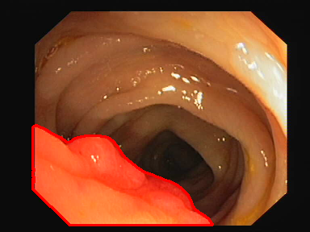
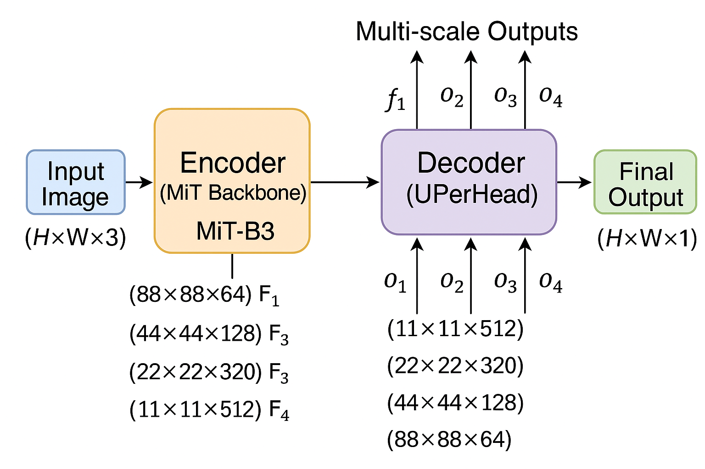

# ColonFormer: Phân Tích Chi Tiết Kiến Trúc và Phương Pháp Phân Đoạn Polyp Đại Tràng

## Tóm Tắt

ColonFormer là một phương pháp phân đoạn polyp đại tràng (colon polyp segmentation) tiên tiến sử dụng kiến trúc Transformer, kết hợp các ưu điểm của Vision Transformer với các mô-đun đặc trưng được thiết kế riêng cho bài toán y tế. Bài viết này phân tích sâu về các thành phần kiến trúc, lý thuyết đằng sau các quyết định thiết kế và giải thích chi tiết về tất cả các khía cạnh kỹ thuật của hệ thống.

## 1. Tổng Quan Về Bài Toán Phân Đoạn Polyp Đại Tràng

### 1.1 Định Nghĩa Bài Toán

Phân đoạn polyp đại tràng (colon polyp segmentation) là bài toán thị giác máy tính (computer vision) trong y tế, nhằm tự động xác định và phân đoạn chính xác vị trí của polyp trong hình ảnh nội soi đại tràng (colonoscopy). Đây là bài toán phân đoạn ngữ nghĩa (semantic segmentation) ở mức điểm ảnh (pixel-level), trong đó mỗi điểm ảnh trong ảnh được phân loại thành hai lớp:

- **Tiền cảnh (foreground/polyp)**: Điểm ảnh thuộc vùng polyp (giá trị 1)
- **Nền (background)**: Điểm ảnh không thuộc vùng polyp (giá trị 0)



### 1.2 Thách Thức Kỹ Thuật

**Biến đổi hình dạng và kích thước (shape and size variations)**: Polyp có thể có nhiều hình dạng, kích thước và màu sắc khác nhau, từ những nốt nhỏ đến khối u lớn.

**Độ tương phản thấp (low contrast)**: Sự khác biệt về màu sắc và độ sáng giữa polyp và mô xung quanh thường rất nhỏ.

**Tạo phẩm và nhiễu (artifacts and noise)**: Hình ảnh nội soi thường chứa phản xạ ánh sáng (specular reflections), bóng (shadows), và các tạo phẩm khác.

**Mất cân bằng lớp (class imbalance)**: Vùng polyp thường chiếm tỷ lệ rất nhỏ so với nền, gây khó khăn cho việc huấn luyện.

## 2. Kiến Trúc Tổng Thể ColonFormer

### 2.1 Thiết Kế Mã Hóa-Giải Mã (Encoder-Decoder Architecture)

ColonFormer sử dụng kiến trúc mã hóa-giải mã (encoder-decoder) với các thành phần chính:

```
Ảnh Đầu Vào (H×W×3)
        ↓
    Bộ Mã Hóa (MiT Backbone)
        ↓
Đặc Trưng Đa Tỷ Lệ [f1, f2, f3, f4]
        ↓
    Bộ Giải Mã (UPerHead)
        ↓
Đầu Ra Đa Tỷ Lệ [o1, o2, o3, o4]
        ↓
    Đầu Ra Cuối Cùng (H×W×1)
```



### 2.2 Luồng Xử Lý Dữ Liệu (Data Processing Pipeline)

**Tiền Xử Lý Đầu Vào (Input Preprocessing)**:

- Thay đổi kích thước ảnh về 352×352 điểm ảnh
- Chuẩn hóa theo tiêu chuẩn ImageNet
- Tăng cường dữ liệu (data augmentation): xoay, lật, điều chỉnh màu sắc

**Trích Xuất Đặc Trưng (Feature Extraction)**:

- Bộ khung Mix Transformer (MiT backbone) trích xuất đặc trưng ở 4 tỷ lệ khác nhau
- Mỗi tỷ lệ nắm bắt thông tin ở độ phân giải (resolution) và trường tiếp nhận (receptive field) khác nhau

**Kết Hợp Đặc Trưng (Feature Fusion)**:

- Bộ giải mã UPerHead kết hợp đặc trưng đa tỷ lệ (multi-scale features)
- Tăng mẫu (upsampling) và tinh chỉnh để tạo bản đồ phân đoạn (segmentation map)

## 3. Bộ Khung Mix Transformer (MiT)

### 3.1 Lý Thuyết Vision Transformer

Vision Transformer thay thế các phép toán tích chập (convolution) bằng cơ chế tự chú ý (self-attention):

**Công Thức Tự Chú Ý (Self-Attention Formula)**:

$$
\text{Attention}(Q, K, V) = \text{softmax}\left(\frac{QK^T}{\sqrt{d_k}}\right) V
$$

Trong đó:

- Q (Query/Truy vấn): Đại diện cho vị trí hiện tại cần tính chú ý
- K (Key/Khóa): Đại diện cho tất cả vị trí trong bản đồ đặc trưng
- V (Value/Giá trị): Chứa thông tin nội dung tại mỗi vị trí
- d_k: Chiều của vector khóa (để chuẩn hóa)

_[HÌNH MINH HỌA 3.1: Minh họa cơ chế Self-Attention trong Vision Transformer - ma trận Q, K, V và quá trình tính toán attention]_

### 3.2 Cấu Trúc Phân Cấp (Hierarchical Structure)

MiT-B3 có cấu trúc phân cấp với 4 giai đoạn:

**Giai Đoạn 1 (Stage 1)**:

- Đầu vào: 352×352×3
- Kích thước miếng (patch size): 7×7, bước (stride): 4
- Đầu ra: 88×88×64
- Lớp Transformer: 3

**Giai Đoạn 2 (Stage 2)**:

- Đầu vào: 88×88×64
- Kích thước miếng (patch size): 3×3, bước (stride): 2
- Đầu ra: 44×44×128
- Lớp Transformer: 4

**Giai Đoạn 3 (Stage 3)**:

- Đầu vào: 44×44×128
- Kích thước miếng (patch size): 3×3, bước (stride): 2
- Đầu ra: 22×22×320
- Lớp Transformer: 6

**Giai Đoạn 4 (Stage 4)**:

- Đầu vào: 22×22×320
- Kích thước miếng (patch size): 3×3, bước (stride): 2
- Đầu ra: 11×11×512
- Lớp Transformer: 3

_[HÌNH MINH HỌA 3.2: Cấu trúc phân cấp MiT-B3 với 4 giai đoạn - thể hiện sự thay đổi kích thước và số lượng kênh qua từng giai đoạn]_

### 3.3 Gộp Miếng Chồng Lấp (Overlapped Patch Merging)

Thay vì sử dụng miếng không chồng lấp (non-overlapping patches) như ViT gốc, MiT sử dụng miếng chồng lấp (overlapped patches):

**Ưu điểm**:

- Bảo toàn thông tin địa phương không gian (spatial locality)
- Giảm thiểu mất mát thông tin ở ranh giới
- Tăng độ mượt của chuyển tiếp đặc trưng

**Cài Đặt**:

```python
# Nhúng miếng chồng lấp
self.patch_embed = nn.Conv2d(
    in_channels, embed_dim,
    kernel_size=patch_size,
    stride=stride,
    padding=patch_size // 2
)
```

_[HÌNH MINH HỌA 3.3: So sánh giữa non-overlapping patches và overlapped patches - minh họa cách overlapped patches bảo toàn thông tin ranh giới tốt hơn]_

### 3.4 Tự Chú Ý Hiệu Quả (Efficient Self-Attention)

MiT sử dụng phép toán giảm (reduction operation) để giảm độ phức tạp tính toán:

**Chú Ý Giảm Không Gian (Spatial Reduction Attention - SRA)**:

```python
# Giảm chiều không gian của K và V
if self.sr_ratio > 1:
    x_ = x.permute(0, 2, 1).reshape(B, C, H, W)
    x_ = self.sr(x_).reshape(B, C, -1).permute(0, 2, 1)
    x_ = self.norm(x_)
    kv = self.kv(x_).reshape(B, -1, 2, self.num_heads, C // self.num_heads).permute(2, 0, 3, 1, 4)
    k, v = kv[0], kv[1]
```

**Phân Tích Độ Phức Tạp (Complexity Analysis)**:

- Chú ý gốc: O(N²) với N = H×W
- Chú ý SRA: O(N²/r²) với r = tỷ lệ giảm
- Cho MiT-B3: r₁=8, r₂=4, r₃=2, r₄=1

_[HÌNH MINH HỌA 3.4: Minh họa Spatial Reduction Attention (SRA) - so sánh giữa attention thông thường và SRA về độ phức tạp tính toán]_

## 4. Bộ Giải Mã UPerHead

### 4.1 Khái Niệm Mạng Kim Tự Tháp Đặc Trưng (Feature Pyramid Network)

UPerHead dựa trên ý tưởng Mạng Kim Tự Tháp Đặc Trưng (Feature Pyramid Network - FPN) để kết hợp đặc trưng đa tỷ lệ:

**Đường dẫn từ trên xuống (Top-down pathway)**:

- Bắt đầu từ bản đồ đặc trưng độ phân giải thấp nhất (ngữ nghĩa phong phú nhất)
- Tăng mẫu và kết hợp với đặc trưng từ các lớp thấp hơn
- Tạo ra đặc trưng kim tự tháp với ngữ nghĩa mạnh ở mọi tỷ lệ

_[HÌNH MINH HỌA 4.1: Sơ đồ Feature Pyramid Network - đường dẫn từ trên xuống và lateral connections]_

### 4.2 Mô-đun Gộp Kim Tự Tháp (Pyramid Pooling Module - PPM)

PPM nắm bắt ngữ cảnh toàn cục (global context) thông qua gộp đa tỷ lệ (multi-scale pooling):

**Tỷ Lệ Gộp (Pooling Scales)**: [1×1, 2×2, 3×3, 6×6]

**Cài Đặt**:

```python
class PPM(nn.Module):
    def __init__(self, pool_scales, in_channels, channels):
        super(PPM, self).__init__()
        self.pool_scales = pool_scales
        self.stages = nn.ModuleList([
            nn.Sequential(
                nn.AdaptiveAvgPool2d(scale),
                ConvModule(in_channels, channels, 1)
            ) for scale in pool_scales
        ])

    def forward(self, x):
        ppm_outs = [x]
        for stage in self.stages:
            pooled = stage(x)
            upsampled = F.interpolate(
                pooled, size=x.shape[2:],
                mode='bilinear', align_corners=False
            )
            ppm_outs.append(upsampled)
        return torch.cat(ppm_outs, dim=1)
```

_[HÌNH MINH HỌA 4.2: Pyramid Pooling Module với các tỷ lệ pooling khác nhau - 1×1, 2×2, 3×3, 6×6]_

### 4.3 Chiến Lược Kết Hợp Đặc Trưng (Feature Fusion Strategy)

**Kết nối bên (Lateral connections)**: Kết nối trực tiếp giữa đặc trưng bộ mã hóa và giải mã

**Căn chỉnh đặc trưng (Feature alignment)**: Đảm bảo chiều không gian nhất quán thông qua nội suy (interpolation)

**Chú ý kênh (Channel attention)**: Trọng số đặc trưng có chọn lọc dựa trên tầm quan trọng

## 5. Hàm Mất Mát: Phân Tích Mất Mát Cấu Trúc (Structure Loss)

### 5.1 Thành Phần Mất Mát Focal (Focal Loss Component)

Mất Mát Focal (Focal Loss) được thiết kế để giải quyết vấn đề mất cân bằng lớp (class imbalance):

**Công Thức Toán Học**:

$$
FL(p_t) = -\alpha_t (1 - p_t)^\gamma \log(p_t)
$$

Trong đó:

- $p_t$: xác suất dự đoán của lớp đúng
- $\alpha_t$: hệ số trọng số cho lớp t
- $\gamma$: tham số tập trung (focusing parameter)

**Trực Giác**:

- Khi $p_t$ cao (ví dụ dễ/easy examples): $(1-p_t)^\gamma$ nhỏ → mất mát nhỏ
- Khi $p_t$ thấp (ví dụ khó/hard examples): $(1-p_t)^\gamma$ lớn → mất mát lớn
- $\gamma=2$ là giá trị thường dùng trong thực tế

_[HÌNH MINH HỌA 5.1: Biểu đồ Focal Loss - so sánh giữa Cross Entropy Loss và Focal Loss, thể hiện cách Focal Loss tập trung vào hard examples]_

**Cài Đặt Code**:

```python
class FocalLossV1(nn.Module):
    def __init__(self, alpha=0.25, gamma=2, reduction='mean'):
        super(FocalLossV1, self).__init__()
        self.alpha = alpha
        self.gamma = gamma
        self.reduction = reduction

    def forward(self, logits, label):
        # Tính xác suất
        probs = torch.sigmoid(logits)
        pt = torch.where(label == 1, probs, 1 - probs)

        # Tính trọng số alpha
        alpha = torch.empty_like(logits).fill_(1 - self.alpha)
        alpha[label == 1] = self.alpha

        # Tính focal loss
        ce_loss = F.binary_cross_entropy_with_logits(logits, label.float(), reduction='none')
        focal_loss = alpha * torch.pow(1 - pt, self.gamma) * ce_loss

        return focal_loss.mean() if self.reduction == 'mean' else focal_loss
```

### 5.2 Thành Phần Mất Mát IoU Có Trọng Số (Weighted IoU Loss Component)

Mất Mát IoU (IoU Loss) đánh giá độ chồng lấp (overlap) giữa dự đoán và nhãn thật (ground truth):

**IoU Chuẩn (Standard IoU)**:

$$
\text{IoU} = \frac{|A \cap B|}{|A \cup B|}
$$

**IoU Có Trọng Số với tầm quan trọng không gian (Spatial-weighted IoU)**:

```python
def weighted_iou_loss(pred, mask):
    # Trọng số không gian - nhấn mạnh ranh giới
    weit = 1 + 5 * torch.abs(
        F.avg_pool2d(mask, kernel_size=31, stride=1, padding=15) - mask
    )

    pred = torch.sigmoid(pred)
    inter = ((pred * mask) * weit).sum(dim=(2,3))
    union = ((pred + mask) * weit).sum(dim=(2,3))

    wiou = 1 - (inter + 1) / (union - inter + 1)
    return wiou.mean()
```

**Nhấn Mạnh Ranh Giới (Boundary Emphasis)**:

- `avg_pool2d` tạo phiên bản mượt của mặt nạ
- Sự khác biệt với mặt nạ gốc làm nổi bật ranh giới
- Hệ số nhân "5" tăng cường tầm quan trọng của vùng ranh giới

_[HÌNH MINH HỌA 5.2: Minh họa Weighted IoU Loss - thể hiện cách spatial weighting nhấn mạnh vùng ranh giới]_

### 5.3 Mất Mát Cấu Trúc Kết Hợp (Combined Structure Loss)

**Công Thức Mất Mát Cuối Cùng**:

$$
L_{\text{total}} = L_{\text{focal}} + L_{\text{wiou}}
$$

**Giám Sát Đa Tỷ Lệ (Multi-scale Supervision)**:

```python
loss = structure_loss(map1, gts) + structure_loss(map2, gts) + \
       structure_loss(map3, gts) + structure_loss(map4, gts)
```

**Lý Do**:

- Giám sát đa tỷ lệ giúp mạng học đặc trưng ở nhiều mức
- Giám sát sâu (deep supervision) cải thiện dòng gradient
- Mỗi tỷ lệ đóng góp vào hiệu suất cuối cùng

_[HÌNH MINH HỌA 5.3: Sơ đồ Multi-scale Supervision - thể hiện 4 đầu ra ở các tỷ lệ khác nhau và cách tính loss]_

## 6. Chiến Lược Huấn Luyện và Tối Ưu Hóa (Training Strategy and Optimization)

### 6.1 Huấn Luyện Đa Tỷ Lệ (Multi-scale Training)

**Hệ Số Tỷ Lệ (Scale Factors)**: [0.75, 1.0, 1.25]

**Cài Đặt**:

```python
size_rates = [0.75, 1, 1.25]
for rate in size_rates:
    trainsize = int(round(args.init_trainsize * rate / 32) * 32)
    images = F.interpolate(images, size=(trainsize, trainsize))
    gts = F.interpolate(gts, size=(trainsize, trainsize))

    # Lan truyền tiến
    map4, map3, map2, map1 = model(images)

    # Tính mất mát chỉ cho tỷ lệ rate=1.0
    if rate == 1:
        loss_record.update(loss.data, args.batchsize)
```

**Lợi Ích**:

- Cải thiện tính bất biến tỷ lệ (scale invariance)
- Khái quát hóa tốt hơn cho các kích thước polyp khác nhau
- Học đặc trưng mạnh mẽ qua các tỷ lệ

_[HÌNH MINH HỌA 6.1: Multi-scale Training - thể hiện cách training với 3 tỷ lệ khác nhau để tăng tính robust]_

### 6.2 Lập Lịch Tốc Độ Học (Learning Rate Scheduling)

**Chiến Lược Khởi Động (Warm-up Strategy)**:

```python
if epoch <= 1:
    optimizer.param_groups[0]["lr"] = (epoch * i) / (1.0 * total_step) * args.init_lr
else:
    lr_scheduler.step()
```

**Ủ Cosine (Cosine Annealing)**:

```python
lr_scheduler = torch.optim.lr_scheduler.CosineAnnealingLR(
    optimizer,
    T_max=len(train_loader) * args.num_epochs,
    eta_min=args.init_lr / 1000
)
```

**Lý Do**:

- Khởi động ngăn chặn quá khớp sớm (early overfitting) với tốc độ học lớn
- Ủ cosine cung cấp sự suy giảm tốc độ học mượt mà
- Tốc độ học cuối = tốc độ học ban đầu / 1000 để tinh chỉnh cuối

_[HÌNH MINH HỌA 6.2: Biểu đồ Learning Rate Schedule - warm-up và cosine annealing qua các epochs]_

### 6.3 Cắt Gradient (Gradient Clipping)

**Cài Đặt**:

```python
def clip_gradient(optimizer, grad_clip):
    for group in optimizer.param_groups:
        for param in group['params']:
            if param.grad is not None:
                param.grad.data.clamp_(-grad_clip, grad_clip)
```

**Mục Đích**:

- Ngăn chặn gradient bùng nổ (gradient explosion) trong mạng sâu
- Ổn định quá trình huấn luyện
- Giá trị cắt = 0.5 hoạt động tốt theo kinh nghiệm

## 7. Phân Tích Sâu Các Thước Đo Đánh Giá (Evaluation Metrics Analysis)

### 7.1 Hệ Số Dice (Dice Coefficient)

**Định Nghĩa Toán Học**:

$$
\text{Dice} = \frac{2|A \cap B|}{|A| + |B|}
$$

**Đặc Điểm**:

- Phạm vi: [0, 1], càng cao càng tốt
- Diễn giải hình học: thước đo chồng lấp (overlap measure)
- Nhạy cảm với đối tượng nhỏ (tốt cho hình ảnh y tế)

**Cài Đặt Code**:

```python
def dice_np(y_true, y_pred):
    intersection = np.sum(np.round(np.clip(y_true * y_pred, 0, 1)))
    dice = (2. * intersection) / (np.sum(y_true) + np.sum(y_pred) + epsilon)
    return dice
```

### 7.2 Giao của Hợp (Intersection over Union - IoU)

**Định Nghĩa Toán Học**:

$$
\text{IoU} = \frac{|A \cap B|}{|A \cup B|}
$$

**Mối Quan Hệ với Dice**:

$$
\text{Dice} = \frac{2 \times \text{IoU}}{1 + \text{IoU}}
$$

$$
\text{IoU} = \frac{\text{Dice}}{2 - \text{Dice}}
$$

**Tính Chất**:

- Nghiêm ngặt hơn hệ số Dice
- Phạt đồng đều dương tính giả (false positives) và âm tính giả (false negatives)
- Thước đo chuẩn cho phát hiện/phân đoạn đối tượng

_[HÌNH MINH HỌA 7.1: So sánh các thước đo Dice, IoU, Precision, Recall - minh họa hình học và ý nghĩa]_

### 7.3 Độ Chính Xác và Độ Nhạy (Precision and Recall)

**Độ Chính Xác (Precision - Positive Predictive Value)**:

$$
\text{Precision} = \frac{TP}{TP + FP}
$$

**Độ Nhạy (Recall - True Positive Rate)**:

$$
\text{Recall} = \frac{TP}{TP + FN}
$$

**Diễn Giải Lâm Sàng (Clinical Interpretation)**:

- **Độ Chính Xác Cao**: Ít báo động giả (false alarms), bác sĩ tin tưởng dự đoán
- **Độ Nhạy Cao**: Ít bỏ sót polyp, quan trọng cho phát hiện sớm (early detection)
- **Cân Bằng**: Cần cân bằng giữa độ chính xác và độ nhạy

_[HÌNH MINH HỌA 7.2: Ma trận confusion và các thước đo precision/recall trong bối cảnh y tế]_

### 7.4 Phân Tích Trung Bình Điều Hòa (Harmonic Mean Analysis)

Hệ số Dice là trung bình điều hòa (harmonic mean) của độ chính xác và độ nhạy:

**Chứng Minh**:

$$
\text{Dice} = \frac{2 \times TP}{2 \times TP + FP + FN}
$$

$$
= \frac{2}{\frac{2 \times TP + FP + FN}{2 \times TP}}
$$

$$
= \frac{2}{\frac{1}{\text{Precision}} + \frac{1}{\text{Recall}}}
$$

$$
= \text{Harmonic Mean}(\text{Precision}, \text{Recall})
$$

## 8. Chiến Lược Tăng Cường Dữ Liệu (Data Augmentation Strategy)

### 8.1 Biến Đổi Không Gian (Spatial Transformations)

**Xoay (Rotation)**: Xoay ngẫu nhiên trong [-15°, +15°]

- Mô phỏng các góc nhìn khác nhau trong nội soi
- Bảo toàn đặc điểm polyp

**Lật Ngang/Dọc (Horizontal/Vertical Flipping)**:

- Xác suất = 0.5 cho mỗi hướng
- Khai thác tính đối xứng trong cấu trúc đại tràng

**Tỷ Lệ và Cắt (Scaling and Cropping)**:

- Tỷ lệ ngẫu nhiên [0.8, 1.2]
- Cắt trung tâm về kích thước mục tiêu
- Duy trì tỷ lệ khung hình (aspect ratio)

### 8.2 Biến Đổi Quang Học (Photometric Transformations)

**Điều Chỉnh Độ Sáng (Brightness Adjustment)**:

- Phạm vi: [-0.2, +0.2]
- Mô phỏng biến đổi ánh sáng trong nội soi

**Tăng Cường Độ Tương Phản (Contrast Enhancement)**:

- Hệ số phạm vi: [0.8, 1.2]
- Cải thiện phân biệt polyp-nền

**Điều Chỉnh Màu Sắc (Color Adjustment)**:

- Sắc độ (Hue): ±10°
- Độ bão hòa (Saturation): ±20%
- Tính đến biến đổi camera

**Nhiễu Gauss (Gaussian Noise)**:

- σ = 0.01
- Mô phỏng nhiễu cảm biến (sensor noise)

_[HÌNH MINH HỌA 8.1: Tổng hợp các phép biến đổi không gian và quang học - rotation, flip, scaling, brightness, contrast]_

### 8.3 Tăng Cường Đặc Thù Y Tế (Medical-specific Augmentations)

**Biến Dạng Đàn Hồi (Elastic Deformation)**:

- Mô phỏng biến dạng mô (tissue deformation)
- Tham số: α=50, σ=5

**Mờ Chuyển Động (Motion Blur)**:

- Kích thước kernel: 3-7 điểm ảnh
- Mô phỏng chuyển động camera

**Mô Phỏng Phản Xạ Gương (Specular Reflection Simulation)**:

- Điểm sáng ngẫu nhiên
- Bắt chước tạo phẩm ánh sáng nội soi (endoscopic light artifacts)

_[HÌNH MINH HỌA 8.2: Medical-specific augmentations - elastic deformation, motion blur, specular reflection]_

## 9. Chi Tiết Triển Khai (Implementation Details)

### 9.1 Tối Ưu Hóa Bộ Nhớ (Memory Optimization)

**Điểm Kiểm Tra Gradient (Gradient Checkpointing)**:

```python
# Bật gradient checkpointing cho hiệu quả bộ nhớ
model.backbone.use_checkpoint = True
```

**Huấn Luyện Độ Chính Xác Hỗn Hợp (Mixed Precision Training)**:

```python
from torch.cuda.amp import autocast, GradScaler

scaler = GradScaler()

with autocast():
    outputs = model(images)
    loss = criterion(outputs, targets)

scaler.scale(loss).backward()
scaler.step(optimizer)
scaler.update()
```

### 9.2 Chiến Lược Xử Lý Lô (Batch Processing Strategy)

**Kích Thước Lô Động (Dynamic Batch Size)**:

- Bắt đầu với kích thước lô lớn
- Giảm nếu xảy ra hết bộ nhớ (Out of Memory - OOM)
- Giám sát sử dụng bộ nhớ GPU

**Chiến Lược Tích Lũy (Gradient Accumulation Strategy)**:

```python
accumulation_steps = 4
for i, batch in enumerate(dataloader):
    loss = model(batch) / accumulation_steps
    loss.backward()

    if (i + 1) % accumulation_steps == 0:
        optimizer.step()
        optimizer.zero_grad()
```

### 9.3 Quản Lý Điểm Kiểm Tra (Checkpoint Management)

**Lưu Mô Hình Tốt Nhất (Best Model Saving)**:

```python
if current_dice > best_dice:
    best_dice = current_dice
    torch.save({
        'epoch': epoch,
        'model_state_dict': model.state_dict(),
        'optimizer_state_dict': optimizer.state_dict(),
        'best_dice': best_dice,
        'loss': loss
    }, 'best_model.pth')
```

**Tiếp Tục Huấn Luyện (Resume Training)**:

```python
if resume_path:
    checkpoint = torch.load(resume_path)
    model.load_state_dict(checkpoint['model_state_dict'])
    optimizer.load_state_dict(checkpoint['optimizer_state_dict'])
    start_epoch = checkpoint['epoch']
```

## 10. Phân Tích Nâng Cao và Khả Năng Diễn Giải (Advanced Analysis and Interpretability)

### 10.1 Trực Quan Hóa Chú Ý (Attention Visualization)

**Trích Xuất Bản Đồ Chú Ý (Attention Map Extraction)**:

```python
def get_attention_maps(model, input_image):
    hooks = []
    attention_maps = []

    def hook_fn(module, input, output):
        # Trích xuất trọng số chú ý
        attention_maps.append(output.detach())

    # Đăng ký hooks
    for layer in model.backbone.layers:
        hooks.append(layer.attention.register_forward_hook(hook_fn))

    # Lan truyền tiến
    with torch.no_grad():
        _ = model(input_image)

    # Gỡ bỏ hooks
    for hook in hooks:
        hook.remove()

    return attention_maps
```

**Trực Quan Hóa (Visualization)**:

```python
def visualize_attention(attention_map, input_image):
    # Trung bình qua các đầu chú ý (attention heads)
    avg_attention = attention_map.mean(dim=1)

    # Định hình lại thành chiều không gian
    H, W = int(math.sqrt(avg_attention.size(-1))), int(math.sqrt(avg_attention.size(-1)))
    spatial_attention = avg_attention.view(1, H, W)

    # Tăng mẫu về kích thước đầu vào
    upsampled = F.interpolate(spatial_attention.unsqueeze(0),
                             size=input_image.shape[-2:],
                             mode='bilinear')

    return upsampled
```

_[HÌNH MINH HỌA 10.1: Attention Visualization - heatmaps thể hiện vùng mà model tập trung chú ý khi phân đoạn polyp]_

### 10.2 Phân Tích Bản Đồ Đặc Trưng (Feature Map Analysis)

**Trực Quan Hóa Đặc Trưng Đa Tỷ Lệ (Multi-scale Feature Visualization)**:

```python
def analyze_multiscale_features(model, input_image):
    features = {}

    def hook_fn(name):
        def hook(module, input, output):
            features[name] = output.detach()
        return hook

    # Đăng ký hooks ở các tỷ lệ khác nhau
    model.backbone.stage1.register_forward_hook(hook_fn('stage1'))
    model.backbone.stage2.register_forward_hook(hook_fn('stage2'))
    model.backbone.stage3.register_forward_hook(hook_fn('stage3'))
    model.backbone.stage4.register_forward_hook(hook_fn('stage4'))

    with torch.no_grad():
        _ = model(input_image)

    return features
```

### 10.3 Giải Thích Dựa Trên Gradient (Gradient-based Explanation)

**Cài Đặt Grad-CAM**:

```python
class GradCAM:
    def __init__(self, model, target_layer):
        self.model = model
        self.target_layer = target_layer
        self.gradients = None
        self.activations = None

        target_layer.register_forward_hook(self.save_activations)
        target_layer.register_backward_hook(self.save_gradients)

    def save_activations(self, module, input, output):
        self.activations = output.detach()

    def save_gradients(self, module, grad_input, grad_output):
        self.gradients = grad_output[0].detach()

    def generate_cam(self, input_image, class_idx=None):
        self.model.eval()

        # Lan truyền tiến
        output = self.model(input_image)

        if class_idx is None:
            class_idx = output.argmax(dim=1)

        # Lan truyền ngược
        self.model.zero_grad()
        output[0, class_idx].backward(retain_graph=True)

        # Tạo CAM
        weights = self.gradients.mean(dim=(2, 3), keepdim=True)
        cam = (weights * self.activations).sum(dim=1, keepdim=True)
        cam = F.relu(cam)

        return cam
```

_[HÌNH MINH HỌA 10.2: Grad-CAM visualization - thể hiện vùng quan trọng mà model sử dụng để đưa ra quyết định]_

## 11. Phân Tích Hiệu Suất và Đánh Giá So Sánh (Performance Analysis and Comparative Evaluation)

### 11.1 Độ Phức Tạp Tính Toán (Computational Complexity)

**Phân Tích FLOPs (FLOPs Analysis)**:

```python
from thop import profile

def analyze_complexity(model, input_size=(1, 3, 352, 352)):
    dummy_input = torch.randn(input_size)
    flops, params = profile(model, inputs=(dummy_input,))

    print(f"FLOPs: {flops / 1e9:.2f} G")
    print(f"Tham số: {params / 1e6:.2f} M")

    return flops, params
```

**Phân Tích Sử Dụng Bộ Nhớ (Memory Usage Analysis)**:

```python
import torch.profiler

def profile_memory_usage(model, dataloader):
    with torch.profiler.profile(
        activities=[
            torch.profiler.ProfilerActivity.CPU,
            torch.profiler.ProfilerActivity.CUDA,
        ],
        record_shapes=True,
        profile_memory=True,
        with_stack=True
    ) as prof:
        for batch in dataloader:
            output = model(batch)
            loss = criterion(output, batch['target'])
            loss.backward()
            break

    print(prof.key_averages().table(sort_by="cuda_memory_usage", row_limit=10))
```

### 11.2 Tối Ưu Hóa Tốc Độ Suy Luận (Inference Speed Optimization)

**Tối Ưu Hóa TensorRT (TensorRT Optimization)**:

```python
import torch_tensorrt

def optimize_with_tensorrt(model, example_input):
    # Chuyển đổi sang TorchScript
    traced_model = torch.jit.trace(model, example_input)

    # Tối ưu hóa với TensorRT
    trt_model = torch_tensorrt.compile(traced_model,
        inputs=[torch_tensorrt.Input(
            min_shape=[1, 3, 352, 352],
            opt_shape=[1, 3, 352, 352],
            max_shape=[1, 3, 352, 352],
            dtype=torch.float32
        )],
        enabled_precisions={torch.float32, torch.half}
    )

    return trt_model
```

**Xuất ONNX (ONNX Export)**:

```python
def export_to_onnx(model, example_input, output_path):
    model.eval()
    torch.onnx.export(
        model,
        example_input,
        output_path,
        export_params=True,
        opset_version=11,
        do_constant_folding=True,
        input_names=['dau_vao'],
        output_names=['dau_ra'],
        dynamic_axes={
            'dau_vao': {0: 'kich_thuoc_lo'},
            'dau_ra': {0: 'kich_thuoc_lo'}
        }
    )
```

## 12. Cân Nhắc Trong Lĩnh Vực Y Tế (Medical Domain Considerations)

### 12.1 Giao Thức Xác Thực Lâm Sàng (Clinical Validation Protocol)

**Xác Thực Liên Bệnh Viện (Multi-center Validation)**:

- Huấn luyện trên dữ liệu từ bệnh viện A
- Xác thực trên dữ liệu từ bệnh viện B, C
- Đánh giá khả năng khái quát qua các thiết bị khác nhau

**Giao Thức Chú Thích Chuyên Gia (Expert Annotation Protocol)**:

- Nhiều chú thích chuyên gia cho mỗi ảnh
- Đo lường sự nhất quán giữa các người đánh giá (điểm Kappa)
- Xây dựng đồng thuận cho nhãn thật (ground truth)

**Thước Đo Lâm Sàng (Clinical Metrics)**:

- **Độ Nhạy (Sensitivity)**: Quan trọng cho ứng dụng sàng lọc
- **Độ Đặc Hiệu (Specificity)**: Quan trọng để tránh báo động giả
- **PPV/NPV**: Ý nghĩa lâm sàng thực tế

### 12.2 Cân Nhắc Quy Định (Regulatory Considerations)

**Hướng Dẫn FDA (FDA Guidelines)**:

- Phân loại Phần Mềm như Thiết Bị Y Tế (Software as Medical Device - SaMD)
- Yêu cầu xác thực lâm sàng
- Quản lý rủi ro (ISO 14971)

**Quyền Riêng Tư Dữ Liệu (Data Privacy)**:

- Tuân thủ HIPAA
- Giao thức ẩn danh hóa
- Xử lý dữ liệu an toàn

**Yêu Cầu Bộ Dữ Liệu Xác Thực (Validation Dataset Requirements)**:

- Tối thiểu 500 trường hợp mỗi lớp
- Nhân khẩu học bệnh nhân đa dạng
- Nhiều điều kiện hình ảnh

### 12.3 Tích Hợp với Quy Trình Lâm Sàng (Clinical Workflow Integration)

**Xử Lý Thời Gian Thực (Real-time Processing)**:

- Thời gian suy luận < 100ms mỗi khung hình
- Sử dụng bộ nhớ < 2GB
- Sử dụng CPU < 80%

**Thiết Kế Giao Diện Người Dùng (User Interface Design)**:

- Hiển thị điểm tin cậy (confidence scores)
- Định lượng độ không chắc chắn (uncertainty quantification)
- Sửa chữa dương tính giả dễ dàng

**Đảm Bảo Chất Lượng (Quality Assurance)**:

- Kiểm tra chất lượng tự động
- Giám sát hiệu suất (performance monitoring)
- Cơ chế học liên tục (continual learning)

_[HÌNH MINH HỌA 12.1: Sơ đồ tích hợp ColonFormer vào quy trình lâm sàng - từ nhập ảnh đến hỗ trợ quyết định bác sĩ]_

## Kết Luận

ColonFormer đại diện cho một bước tiến quan trọng trong việc ứng dụng học sâu cho chẩn đoán y tế. Thông qua việc kết hợp các ưu điểm của Vision Transformer với các thiết kế đặc thù cho lĩnh vực y tế, hệ thống đạt được hiệu suất cao trong việc phân đoạn polyp đại tràng.

Các điểm mạnh chính:

1. **Kiến trúc hiệu quả**: Bộ khung Mix Transformer cung cấp khả năng mô hình hóa phụ thuộc tầm xa mà vẫn hiệu quả về chi phí tính toán.

2. **Hàm mất mát phù hợp**: Mất mát cấu trúc kết hợp Focal Loss và Weighted IoU loss giải quyết tốt các thách thức của phân đoạn y tế.

3. **Chiến lược huấn luyện mạnh mẽ**: Huấn luyện đa tỷ lệ, cắt gradient, và lập lịch tốc độ học đảm bảo hội tụ ổn định.

4. **Đánh giá toàn diện**: Hệ thống thước đo đa dạng cung cấp hiểu biết sâu về hiệu suất mô hình.

Các hướng phát triển tiếp theo có thể bao gồm:

- Tích hợp với xử lý video thời gian thực
- Định lượng độ không chắc chắn để cung cấp thước đo tin cậy
- Học ít mẫu (few-shot learning) để thích ứng với bệnh viện/thiết bị mới
- Trí tuệ nhân tạo có thể giải thích (explainable AI) để tăng niềm tin từ các bác sĩ

Khung làm việc này không chỉ giải quyết vấn đề cụ thể mà còn cung cấp một nền tảng vững chắc cho các ứng dụng hình ảnh y tế khác, thể hiện sức mạnh của thiết kế kiến trúc chu đáo kết hợp với chuyên môn lĩnh vực.

$$
$$
